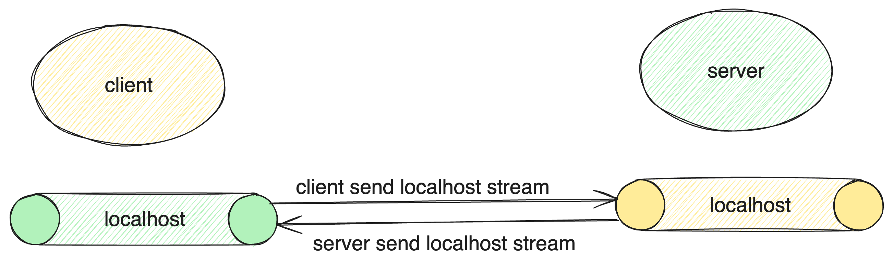
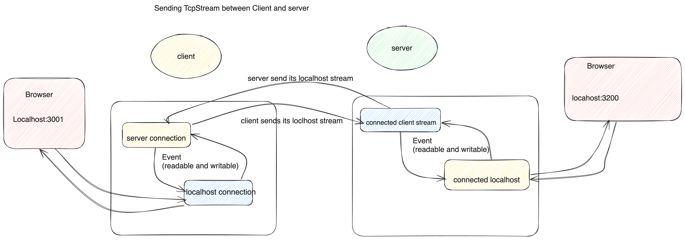

## Simple Localhost tunneling



The code make use of `mio` to manage server connection, client stream and lochols stream events, track when they are readable and
when they are writeable



### Client

- connect to server address
- connect to it localhost connection (you can start a server on `python3 -m http.server 3001`)
- register server and localhost connection as event
- whenever there is a stream comming from the server, we write the stream to the lochols tcpstream
- whenevr there is a stream coming from the localhost , we write it to the server tcpstream

### Server

- server binds to a port and create TcpListener
- register server to event
- any readable event on the server listener, means a client is trying to connect
- client request to connect is accepted
- bind to a localhost port and create TcpListener for localhost
- register localhost TcpListener to event
- map localhost TcpListener to incoming client TcpStream
- on any readable event on localhost TcpListener, it mean server local browser is ready to access the localhost port
- accept connection, and remap localhost stream from the connection to client TcpStream ( `localhost Tcpstream -> client TcpStream`)
- register both Localhost stream and client TcpStream to an event
- on any readable event localhost TcpStream, write the stream to client TcpStream
- on any readable event on client TcpStream, write the stream to Locahost TcpStream
- on any writeable event on localhost stream, read from client stream and then write to localhost TcpSatream (**this migh not be needed since client readable event is already doing thesame.**)
- on any writeable event on client TcpStream , read from localhost tcpstream and write to client tcpstream (**same as the comment in the previous item**)

### Run

#### client

start server

```
python3 -m http.server 3001
```

run client code

```
cargo run -- --client
```

#### server

run server code

```
cargo run -- --server
```

then go to the browser and view `localhost:3200`

**Note** ip and port should be changed in code

ALSO THIS DOES NOT WORK PERFECTLY; ONCE CONNECTION IS ESATBLISH ON BOTH END AND CLIENT PAGE CAN BE VIEWED IN SERVER BROWSER IF REFRETCHED THE CONNECTION IS LOST
